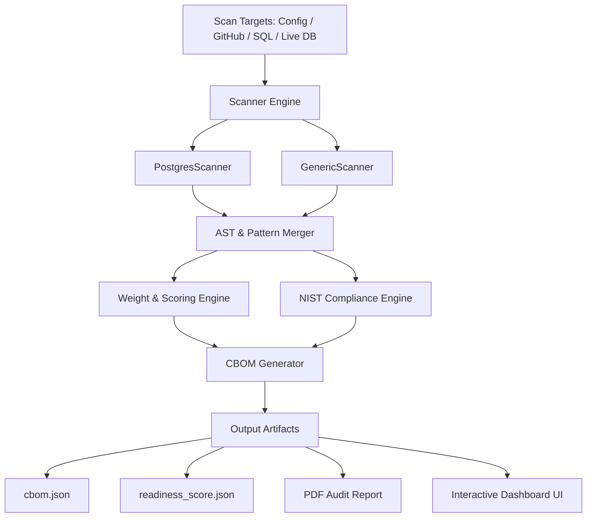

# 🛡️ pgcrypto PQC Scanner & Audit Suite

[](https://csrc.nist.gov/projects/post-quantum-cryptography)
[](https://www.postgresql.org/)
[](https://csrc.nist.gov/)
[](https://www.python.org/)
[](LICENSE)

> **Prepare your PostgreSQL databases for the Quantum Era.**  
> `pgcrypto PQC Scanner` is an enterprise-grade post-quantum cryptography audit framework designed specifically for PostgreSQL environments, `pgcrypto` SQL usage, database configurations, connection parameters, C-extensions, and application SQL scripts.

---

## 📑 Table of Contents

- [⚡ Features](#-features)
- [🌌 Why Post-Quantum Cryptography (PQC)?](#-why-post-quantum-cryptography-pqc)
- [🏗️ System Architecture](#️-system-architecture)
- [🚀 Quick Start](#-quick-start)
- [💻 Command Line Reference](#-command-line-reference)
- [📋 Scanning Modes](#-scanning-modes)
- [📊 Output Artifacts & CBOM Standard](#-output-artifacts--cbom-standard)
- [🏛️ NIST Compliance Matrix](#️-nist-compliance-matrix)
- [📈 Quantum Readiness Score Calculation](#-quantum-readiness-score-calculation)
- [📑 PDF & Report Generation](#-pdf--report-generation)
- [🌐 Web Dashboard](#-web-dashboard)
- [🤝 Contributing](#-contributing)
- [📄 License](#-license)

---

## ⚡ Features

- 🔍 **Deep AST & Regex Pattern Matching**: Scans SQL migrations, stored procedures, `pgcrypto` calls (`digest`, `hmac`, `pgp_sym_encrypt`, `encrypt_iv`), TLS config, and C extension code.
- 📦 **Cryptographic Bill of Materials (CBOM)**: Export findings to standardized JSON CBOM format for software supply chain security.
- 📐 **NIST PQC Standards Mapping**: Maps identified legacy algorithms (RSA, ECC, AES-128, SHA-1, MD5) directly to modern NIST PQC replacements (**ML-KEM/FIPS 203**, **ML-DSA/FIPS 204**, **SLH-DSA/FIPS 205**).
- 🏆 **Quantum Readiness Scoring**: Calculates a dynamic readiness score (0 - 100) based on severity weights, algorithm risks, and exposure surfaces.
- 🖥️ **Interactive Web Dashboard**: Beautiful local web UI for inspecting findings, algorithm breakdown, NIST compliance metrics, and interactive remediation guidance.
- 📄 **Automated PDF Executive Audit Reports**: Generates publication-ready PDF audit reports and presentation slides automatically.
- 🐙 **Multi-Target Auditing**: Supports scanning local directories, raw SQL files, live PostgreSQL instances, or remote GitHub repositories.

---

## 🌌 Why Post-Quantum Cryptography (PQC)?

Quantum computers leveraging **Shor's Algorithm** will render traditional asymmetric cryptography (RSA, ECC, ECDSA, Diffie-Hellman) obsolete, breaking standard database encryption, digital signatures, and key exchanges. Furthermore, **Grover's Algorithm** reduces the effective key strength of symmetric ciphers (AES-128) and hash functions (SHA-256) by half.

```
       LEGACY CRYPTOGRAPHY                          PQC STANDARDS (NIST)
┌─────────────────────────────────┐           ┌─────────────────────────────────┐
│ RSA-2048 / 4096 (Asymmetric)    │  ────►    │ ML-KEM / FIPS 203 (Kyber)       │
│ ECC / ECDSA (Signatures)        │  ────►    │ ML-DSA / FIPS 204 (Dilithium)   │
│ Hash-based Signatures           │  ────►    │ SLH-DSA / FIPS 205 (SPHINCS+)   │
│ AES-128 (Symmetric)             │  ────►    │ AES-256 / AES-256-GCM           │
└─────────────────────────────────┘           └─────────────────────────────────┘
```

The `pgcrypto PQC Scanner` helps database administrators, security teams, and compliance officers detect legacy cryptographic dependencies before quantum adversaries intercept and decrypt sensitive store-now-decrypt-later data.

---

## 🏗️ System Architecture



---

## 🚀 Quick Start

### Prerequisites

- **Python**: Version `3.8+`
- **PostgreSQL Client (Optional)**: `psycopg2` (only required for live database scanning)
- **LaTeX (Optional)**: `pdflatex` (only required for PDF audit report compilation)

### Installation

```bash
# Clone the repository
git clone https://github.com/user/pgcrypto_scanner.git
cd pgcrypto_scanner

# (Optional) Create virtual environment
python3 -m venv venv
source venv/bin/activate  # On Windows: venv\Scripts\activate

# Install dependencies (if using live host scanning)
pip install psycopg2-binary
```

---

## 💻 Command Line Reference

```bash
python3 pgcrypto_scanner.py [INPUT MODES] [OPTIONS]
```

### Options Overview

| Flag | Long Flag | Description | Default |
| :--- | :--- | :--- | :--- |
| `-c` | `--config` | Path to local PostgreSQL config directory | `None` |
| `-g` | `--github` | Remote GitHub repository URL to clone & scan | `None` |
| `-s` | `--sql` | Directory containing SQL scripts / migrations | `None` |
| | `--host` | PostgreSQL host for live database scan | `None` |
| `-p` | `--port` | PostgreSQL port | `5432` |
| `-u` | `--user` | PostgreSQL user | `postgres` |
| `-n` | `--name` | Custom project name | Directory/Repo Name |
| `-o` | `--output` | Output directory for report artifacts | Current Directory |
| | `--no-dashboard` | Disable automated web dashboard launch | `False` |
| | `--json` | Output raw JSON data only | `False` |
| `-v` | `--verbose` | Enable verbose debugging console logs | `False` |

---

## 📋 Scanning Modes

### 1. Local Configuration Directory Scan
Scan PostgreSQL server configuration files (e.g., `postgresql.conf`, `pg_hba.conf`, SSL certificates):
```bash
python3 pgcrypto_scanner.py --config /etc/postgresql/16/main/ --name "ProdDBServer"
```

### 2. GitHub Repository Audit
Automatically clone and scan application repositories containing SQL migrations or `pgcrypto` usage:
```bash
python3 pgcrypto_scanner.py --github https://github.com/example/backend-service --name "BackendService"
```

### 3. SQL Migrations & Stored Procedures
Scan a specific folder containing SQL migration scripts:
```bash
python3 pgcrypto_scanner.py --sql ./migrations/ --name "AppMigrations"
```

### 4. Hybrid / Live PostgreSQL Scanning
Combine local config scanning with live database schema inspection:
```bash
python3 pgcrypto_scanner.py --config /etc/postgresql/16/main/ --host localhost --user postgres --name "FullDatabaseAudit"
```

---

## 📊 Output Artifacts & CBOM Standard

Scanning produces machine-readable and human-readable output files:

1. **`cbom.json`**: Standardized Cryptographic Bill of Materials listing all detected cryptographic assets, file paths, line numbers, algorithm names, key sizes, and PQC risk metrics.
2. **`readiness_score.json`**: Detailed score summary including compliance percentages, risk weights, and algorithm counts.
3. **`dashboard/`**: Complete HTML/JS web dashboard for interactive analysis.

### Sample `cbom.json` Structure

```json
{
  "cbom_version": "1.0",
  "project_name": "PostgreSQL Audit",
  "timestamp": "2026-07-29T19:30:00",
  "summary": {
    "total_assets": 12,
    "quantum_vulnerable": 8,
    "pqc_ready": 4
  },
  "components": [
    {
      "name": "pgcrypto_bf_hash",
      "type": "cryptographic-hash",
      "algorithm": "BF",
      "location": "schema.sql:L42",
      "pqc_risk": "HIGH",
      "recommended_replacement": "Argon2id / ML-KEM"
    }
  ]
}
```

---

## 🏛️ NIST Compliance Matrix

The scanner benchmarks your cryptographic footprint against modern **NIST Post-Quantum Cryptography Standards**:

| Legacy Cryptography | Vulnerability Type | NIST PQC Replacement | NIST Standard | Compliance Status |
| :--- | :--- | :--- | :--- | :--- |
| **RSA / DSA** | Shor's Algorithm (Factorization) | **ML-DSA** (Dilithium) / **SLH-DSA** (SPHINCS+) | FIPS 204 / FIPS 205 | ❌ Non-Compliant |
| **ECC / ECDSA** | Shor's Algorithm (Discrete Log) | **ML-DSA** / **FN-DSA** (Falcon) | FIPS 204 | ❌ Non-Compliant |
| **ECDH / DH** | Shor's Algorithm (Key Exchange) | **ML-KEM** (Kyber) | FIPS 203 | ❌ Non-Compliant |
| **AES-128 / Blowfish** | Grover's Algorithm (Effective 64-bit) | **AES-256-GCM** / **AES-256** | NIST SP 800-38D | ⚠️ Warning |
| **SHA-1 / MD5** | Collision Attacks & Quantum Decay | **SHA-3** / **SHAKE-256** | FIPS 202 | ❌ Non-Compliant |

---

## 📈 Quantum Readiness Score Calculation

The **Quantum Readiness Score** ($S$) ranges from **0** (Critically Vulnerable) to **100** (Quantum Safe).

$$S = 100 - \min\left(100, \sum_{i=1}^{N} W(A_i) \times C(A_i)\right)$$

Where:
- $W(A_i)$ is the severity risk weight assigned to algorithm $A_i$:
  - **Critical Risk (30 pts)**: RSA, ECC, ECDSA, Diffie-Hellman
  - **High Risk (20 pts)**: MD5, SHA-1, Blowfish, DES
  - **Medium Risk (10 pts)**: AES-128, SHA-256 (Key Exchange context)
  - **Quantum Safe (0 pts)**: AES-256, SHA-3, ML-KEM, ML-DSA
- $C(A_i)$ is the frequency count of findings for algorithm $A_i$.

---

## 📑 PDF & Report Generation

Generate publication-ready PDF reports and presentation slides directly from scan results using the built-in generator scripts:

```bash
# Generate LaTeX & compile PDF Audit Report
python3 generate_pdf_report.py

# Generate PDF Executive Presentation Script
python3 generate_script_pdf.py

# Generate User Guide PDF
python3 generate_guide.py
```

Generated files:
- 📄 `pqc_audit_report.pdf`: Full technical audit report.
- 📊 `presentation_script.pdf`: Executive briefing slides.
- 📘 `pgcrypto_scanner_guide.pdf`: Complete user manual.

---

## 🌐 Web Dashboard

Unless `--no-dashboard` or `--json` is specified, scanning automatically generates a standalone interactive Web Dashboard in the `dashboard/` directory.

To serve or view the dashboard manually:
```bash
python3 -m http.server 8000 --directory dashboard
```
Open your browser at `http://localhost:8000` to inspect:
- 📉 Dynamic score breakdown charts
- 📌 Risk level filtering (Critical, High, Medium, Low)
- 💡 Direct code snippet locations & remediation hints

---

## 🤝 Contributing

Contributions are welcome! To contribute:

1. Fork the Repository
2. Create a Feature Branch (`git checkout -b feature/pqc-rule-update`)
3. Commit your Changes (`git commit -m 'Add new PQC AST rule for pgcrypto'`)
4. Push to the Branch (`git push origin feature/pqc-rule-update`)
5. Open a Pull Request

---

## 📄 License

This project is licensed under the MIT License - see the [LICENSE](LICENSE) file for details.
